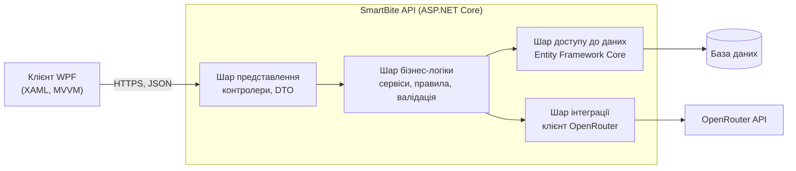

# SmartBite

SmartBite - настільний застосунок для ОС Windows, призначений для планування харчування. Застосунок розраховує персональну добову норму калорій, білків, жирів і вуглеводів (КБЖВ), веде облік продуктів, наявних у користувача, формує рецепти з цих продуктів з урахуванням залишку добової норми та оцінює калорійність страви за фотографією або текстовим переліком інгредієнтів.

Проєкт виконується в межах навчальної дисципліни "Програмна інженерія. Частина 1".

---

## Призначення

Ручний підрахунок калорійності їжі потребує значних затрат часу, а вибір страви з продуктів, які вже є вдома, часто відбувається без урахування добової норми. Поширені рішення для обліку харчування орієнтовані переважно на мобільні пристрої та не пов'язують облік наявних продуктів із добором рецептів.

SmartBite поєднує в одному застосунку три складові: розрахунок норми, облік наявних продуктів і щоденник харчування. Генерація рецептів та оцінка калорійності виконуються за допомогою мовних моделей, доступ до яких надає сервіс OpenRouter.

## Основні можливості

- розрахунок добової норми КБЖВ за параметрами тіла, рівнем фізичної активності та метою користувача;
- облік наявних продуктів із зазначенням кількості та категорії;
- генерація рецепта з вибраних наявних продуктів з урахуванням залишку добової норми;
- оцінка калорійності страви за фотографією або текстовим переліком інгредієнтів (модель Gemini);
- щоденник харчування з денним підсумком відносно норми.

## Команда

| Учасниця               | Основна зона відповідальності                                          |
| ---------------------- | ---------------------------------------------------------------------- |
| Лопушанська Каріна     | серверна частина (API), модель даних, розрахунок норм, CI, планування |
| Климкович Сандра       | клієнт WPF, проєктування інтерфейсу, інтеграція з AI, вимоги, тестування |

## Технології

| Складова                  | Технологія                                                        |
| ------------------------- | ----------------------------------------------------------------- |
| Мова та платформа         | C#, .NET 10                                                       |
| Серверна частина          | ASP.NET Core Web API, багатошарова архітектура                    |
| Настільний клієнт         | WPF (XAML), шаблон MVVM                                           |
| Доступ до даних           | Entity Framework Core (працює поверх ADO.NET)                     |
| База даних                | реляційна СКБД на сервері                                         |
| Мовні моделі              | OpenRouter API; модель Gemini для оцінки калорійності             |
| Тестування                | xUnit                                                             |
| Контроль версій і планування | Git, GitHub                                                    |
| Неперервна інтеграція     | GitHub Actions                                                    |

## Загальна архітектура

Система складається з двох застосунків: настільного клієнта та серверного API. Клієнт не звертається до бази даних і до сервісу OpenRouter безпосередньо - усі операції виконуються через API. Серверна частина побудована за багатошаровою архітектурою з розділенням відповідальності між шарами.



## Документація

- `docs/01-project-card.md` - картка проєкту
- `docs/02-team.md` - команда та відповідальність
- `docs/03-requirements.md` - вимоги та історії користувача
- `docs/04-competitor-analysis.md` - аналіз конкурентів
- `docs/05-mvp.md` - MVP
- `docs/06-backlog.md` - перелік завдань

## Структура репозиторію

```
smartbite/
├── docs/          документація проєкту
├── src/           вихідний код (буде створено на етапі 5)
├── tests/         автоматизовані тести (буде створено на етапі 5)
└── README.md
```

## Збирання та запуск

Інструкцію зі збирання та запуску буде додано після створення початкової структури рішення (етап 5).

Попередньо необхідні засоби:

- ОС Windows 10 або 11;
- .NET SDK 10;
- сервер реляційної бази даних, до якого підключається API;
- ключ доступу до OpenRouter API (зберігається поза репозиторієм).
