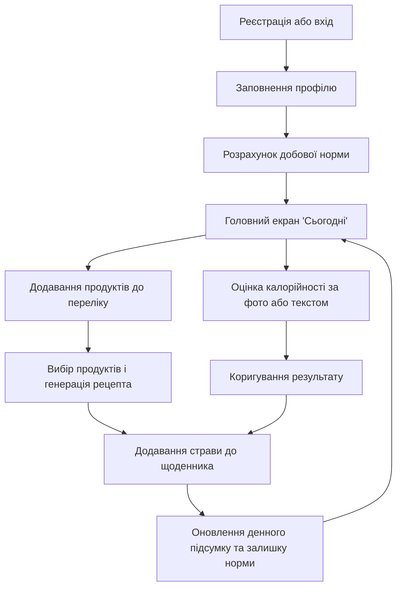

# Мінімальна версія продукту (MVP)

## 1. Призначення MVP

MVP - перша робоча версія SmartBite, яка покриває основний сценарій: від реєстрації до внесення страви до щоденника. На ній ми хочемо перевірити, що облік наявних продуктів, генерація рецептів і оцінка калорійності разом працюють у вибраній архітектурі та справді економлять користувачу час.

## 2. Основний сценарій

Сценарій має дві гілки:

1. **"Приготувати з наявного"** - користувач вибирає продукти, отримує рецепт у межах залишку норми й додає страву до щоденника;
2. **"Врахувати з'їдене"** - користувач завантажує фото страви або вводить продукти текстом, виправляє результат і додає його до щоденника.

## 3. Що входить до MVP

- **Обліковий запис і профіль:** реєстрація, вхід, заповнення профілю, розрахунок добової норми КБЖВ.
- **Мої продукти:** додавання, редагування та видалення продуктів.
- **Рецепти:** генерація рецепта з вибраних продуктів з урахуванням залишку норми, перевірка відповіді моделі.
- **Оцінка калорійності:** за фотографією та за текстом, з можливістю виправити масу й склад.
- **Щоденник:** записи про прийоми їжі та денний підсумок відносно норми.

## 4. Екрани клієнта

| Екран               | Що на ньому є                                                                                                                    |
| ------------------- | -------------------------------------------------------------------------------------------------------------------------------- |
| Вхід і реєстрація   | поля пошти та пароля, перемикання між входом і реєстрацією                                                                       |
| Профіль             | параметри тіла, рівень активності, мета; розрахована норма калорій, білків, жирів і вуглеводів                                   |
| Сьогодні (головний) | вибір дати, прогрес виконання норми, записи за прийомами їжі, кнопки "Додати вручну", "Оцінити страву", "Приготувати з наявного" |
| Мої продукти        | таблиця продуктів, форма додавання та редагування, вибір продуктів для рецепта                                                   |
| Рецепт              | вибрані продукти, кнопка "Згенерувати", інгредієнти, кроки, КБЖВ порції, кнопка "Додати до щоденника"                            |
| Оцінка калорійності | перемикач "Фото / Текст", таблиця компонентів із редагованою масою, підсумок, кнопка "Додати до щоденника"                       |

Між екранами користувач переходить через бічну панель головного вікна.

## 5. Технічний склад

| Компонент                    | Що робить                                                        |
| ---------------------------- | ---------------------------------------------------------------- |
| Клієнт WPF                   | екрани, перевірка введення, запити до API                        |
| API: шар представлення       | контролери, DTO, автентифікація за JWT                           |
| API: шар бізнес-логіки       | розрахунок норми, перевірка відповідей моделей, перерахунок КБЖВ |
| API: шар доступу до даних    | Entity Framework Core: контекст бази даних, міграції             |
| API: інтеграція з OpenRouter | запити до мовних моделей і розбір відповідей                     |
| База даних на сервері        | користувачі, профілі, продукти, записи щоденника                 |

Попередній перелік груп ендпоінтів API:

| Група                     | Призначення                             |
| ------------------------- | --------------------------------------- |
| `/api/auth`               | реєстрація та вхід                      |
| `/api/profile`            | профіль і добова норма                  |
| `/api/products`           | перелік продуктів                       |
| `/api/recipes/generate`   | генерація рецепта                       |
| `/api/nutrition/estimate` | оцінка калорійності за фото або текстом |
| `/api/diary`              | записи щоденника та денний підсумок     |

## 6. Коли MVP вважається готовим

1. Основний сценарій виконується повністю в обох гілках.
2. Рішення збирається, API і клієнт запускаються за інструкцією.
3. Модульні тести розрахунку норми та перевірки відповідей моделей проходять.
4. Збирання та тести автоматично запускаються в GitHub Actions.
5. У репозиторії немає ключа OpenRouter та інших секретних даних.
